```{python}
# | label: setup
from pathlib import Path

import IPython.display as ipd
import polars as pl

ppt = pl.read_csv(Path("data/participants.csv"))
```


## Continuous speech is hierarchically organised into discrete units

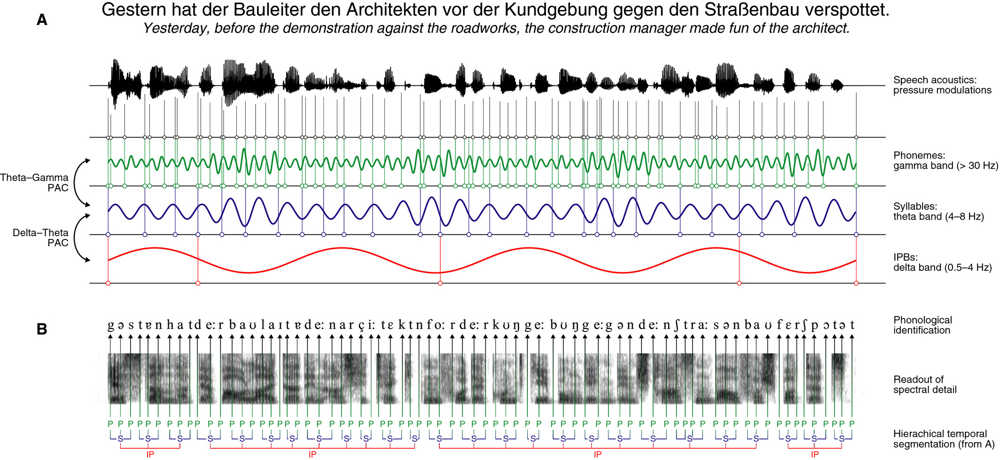^[@meyer2018neural]

## Newborns can detect syllables in continuous speech

Newborns (and infants, adults) preferentially chunk the speech signal into [syllable-sized units]{style="background-color: #e3e1e1;"}^[e.g., @bijeljac19934; @flo2022sleeping; @luo2007phase; @jusczyk1987representation; @bertoncini1988investigation]

## Syllabic structure

<br>

|Structure |Onset  |Nucleus  |Coda  |
|----------|:-----:|:-------:|:----:|
| V        |       |a        |      |
| CV       | t     |a        |      |
| CVC      | t     |a        |n     |
| VC       |       |a        |n     |


## Language-**specific** constraints to syllabic structure

| Structure | Japanese     | Spanish          | English         |
|-----------|--------------|------------------|-----------------|
|V          | [u]{style="background-color: #e3e1e1;"}.mi     | [o]{style="background-color: #e3e1e1;"}.jo         | [a]{style="background-color: #e3e1e1;"}.ny        |
|CV         | [ya]{style="background-color: #e3e1e1;"}.ma.ha | [ca]{style="background-color: #e3e1e1;"}.sa        | [fai]{style="background-color: #e3e1e1;"}.ry      | 
|CVC        | [hon]{style="background-color: #e3e1e1;"}.da   | [rin]{style="background-color: #e3e1e1;"}.cón      | [con]{style="background-color: #e3e1e1;"}.trol    |
|CCVC       |              | [fres]{style="background-color: #e3e1e1;"}.co      | [fresh]{style="background-color: #e3e1e1;"}       |
|CCVCC      |              | [trans]{style="background-color: #e3e1e1;"}.por.te | [shrink]{style="background-color: #e3e1e1;"}     |
|CCCVCCC    |              |                  | [strengths]{style="background-color: #e3e1e1;"}   |


## Language-**universal** constraints to syllabic structure

**Maximal Onset Principle (MOP)**

Linguistic universal
: Consonants are preferably grouped at syllabic onset

<br>

* MOP following [MOP+]{style="background-color: #5778a4; color: white"}: CV.CCV - /mo.pla/
* MOP violating [MOP-]{style="background-color: #e49444; color: white"}: CVC.CV - /mop.la/

::: box
Is MOP a mechanism for detecting syllables at birth?

**Are newborns sensitive to violations of the MOP?
**
:::


## The present study

Functional near-infrared light spoctroscopy (**fNIRS**):

- Relative changes in concentration of oxy-hemoglobin ([$\Delta$HbO]{style="background-color: #E15759; color: white"}) and deoxy-hemoglobin ([$\Delta$HbR]{style="background-color: #4E79A7; color: white"}) across time (haemodynamic response)
- Indirect measure of neural activity, mostly in the cortex

::: columns
:::: column
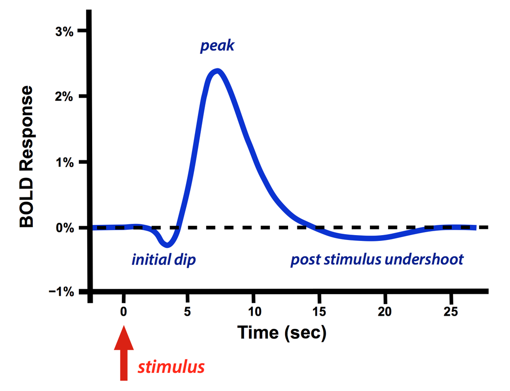
::::
:::: column
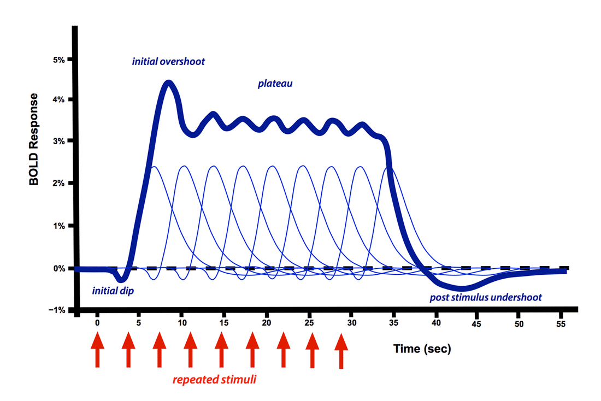
::::
:::


## Are newborns sensitive to (violations of) the MOP?

::: box
**Hypothesis 1**
: If newborns are sensitive to violations of the MOP, the haemodynamic responses to MOP+ and MOP- words should differ.
:::

<br>

## Are newborns sensitive to (violations of) the MOP?

::: box
**Hypothesis 2**
: If newborns have an innate preference for MOP+ structures, the haemodynamic response to MOP+ words should be *greater* than for MOP- words.
:::

## Are newborns sensitive to (violations of) the MOP?

Newborns sometimes rely exclusively on 1st syllables^[@flo2022sleeping]

::: box
**Hypothesis 3**
: If newborns discriminate between MOP+ and MOP- (Hypothesis 1), they do so by processing the disyllabic structure of the word (not just the first syllable).
:::

## Stimuli

**CVCCV words**: Onset + Vowel + Consonant cluster (CC) + Vowel

| **List** | **Type** | **Structure** | **Words** |
|----------|---------------|---------------------|-----------|
| 1   | [MOP+]{style="background-color: #5778a4; color: white"} | CV-CCV              | mo-pla, sa-klo, ti-ple, de-kli | 
|          | [MOP-]{style="background-color: #e49444; color: white"}  | CVC-CV              | mop-la, sak-lo, tip-le, dek-li | 
|          | [MOP- (1st)]{style="background-color: #6a9f58; color: white"} | CVC                 | mop, sak, tip, dek |
| 2   | [MOP+]{style="background-color: #5778a4; color: white"}         | CV-CCV              | mo-kla, sa-plo, ti-kle, de-pli |
|          | [MOP-]{style="background-color: #e49444; color: white"}     | CVC-CV              | mok-la, sap-lo, tik-le, dep-li |
|          | [MOP- (1st)]{style="background-color: #6a9f58; color: white"} | CVC                 | mok, sap, tik, dep             |
: {tbl-colwidths="[4,25, 13, 50]"}

## Stimuli

* Synthesised using MBROLA  (`it4` voice) (*pymbrola* Python package)
* 25 ms pause between syllables
* Flat pitch: 200 Hz
* Manually removed offset voicing from CVC syllables (Praat)

## Task design

*Block design* (bigger expected effect size)^[e.g., @abboub2016prosodic]

Oddball-like paradigm^[@mahmoudzadeh2013syllabic]

Up to 40 min duration

::: columns
:::: column

::::: box
Blocks > Trials > Words
:::::

::::
:::: column

Standard blocks [ST]{style="background-color: #5778a4; color: white"}

Deviant word blocks [DW]{style="background-color: #e49444; color: white"}

Deviant syllable blocks [DS]{style="background-color: #6a9f58; color: white"}

::::
:::

## Task design

Standard [ST]{style="background-color: #5778a4; color: white"} block: MOP+ (e.g., *mo-pla*)

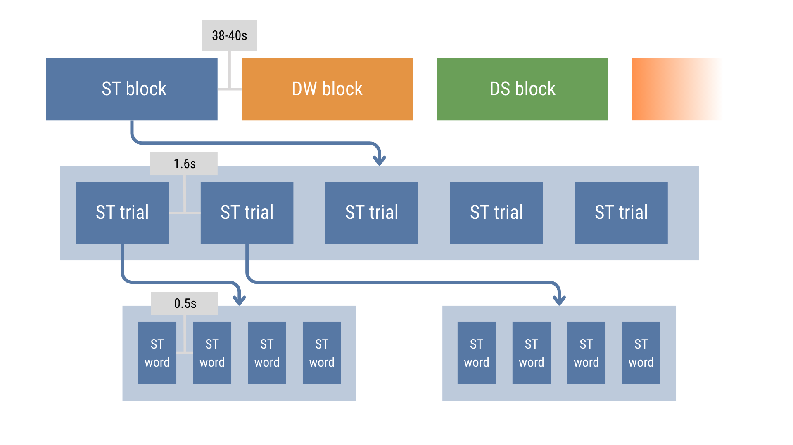

```{python}
# | label: audio-st-block
ipd.Audio("sounds/st-block.wav")
```

## Task design

Deviant word [DW]{style="background-color: #e49444; color: white"} block: MOP- (e.g., *mop-la*)


```{python}
# | label: audio-dw-block
ipd.Audio("sounds/dw-block.wav")
```

## Task design

Deviant syllable [DS]{style="background-color: #6a9f58; color: white"} block: MOP- 1st syllable (e.g., *mop*)

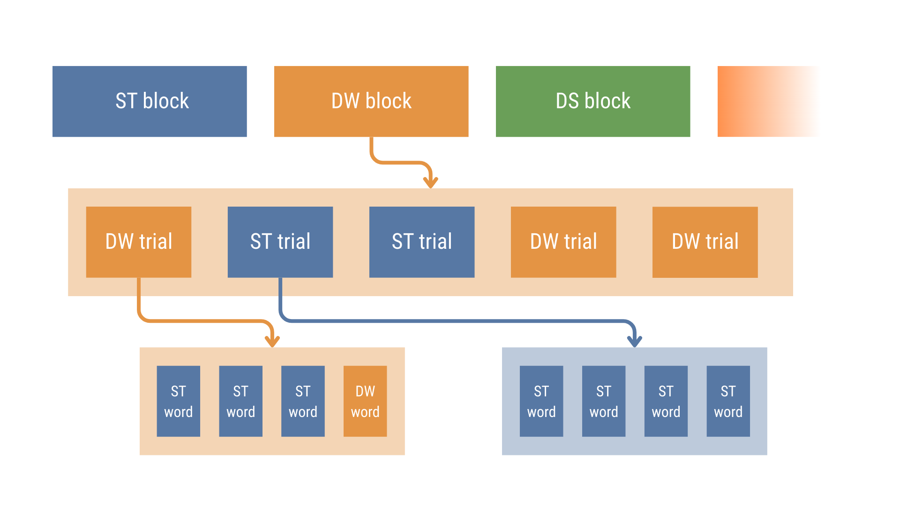

```{python}
# | label: audio-ds-block
ipd.Audio("sounds/ds-block.wav")
```

## Participants

```{python}
# | label: participants
n_ppt = len(ppt)
n_female = sum(s == "Female" for s in ppt["sex"])
```

* `{python} n_ppt` healthy, full term neonates (`{python} n_female` female)
* Recruited from Hospital Sant Joan de Déu (Barcelona) after delivery.^[10 min. Apgar score $\geq$ 8, $\geq$ 37 gestation weeks, $\geq$ 2,700g birth weight.]
* Tested inside hospital room 6-36 hours after delivery

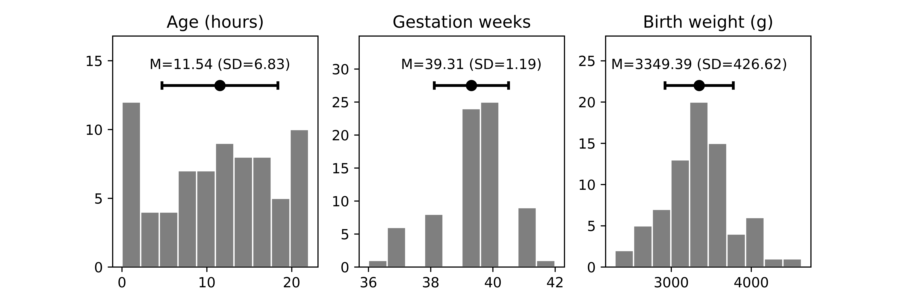

## Procedure

::: {layout-ncol=2}
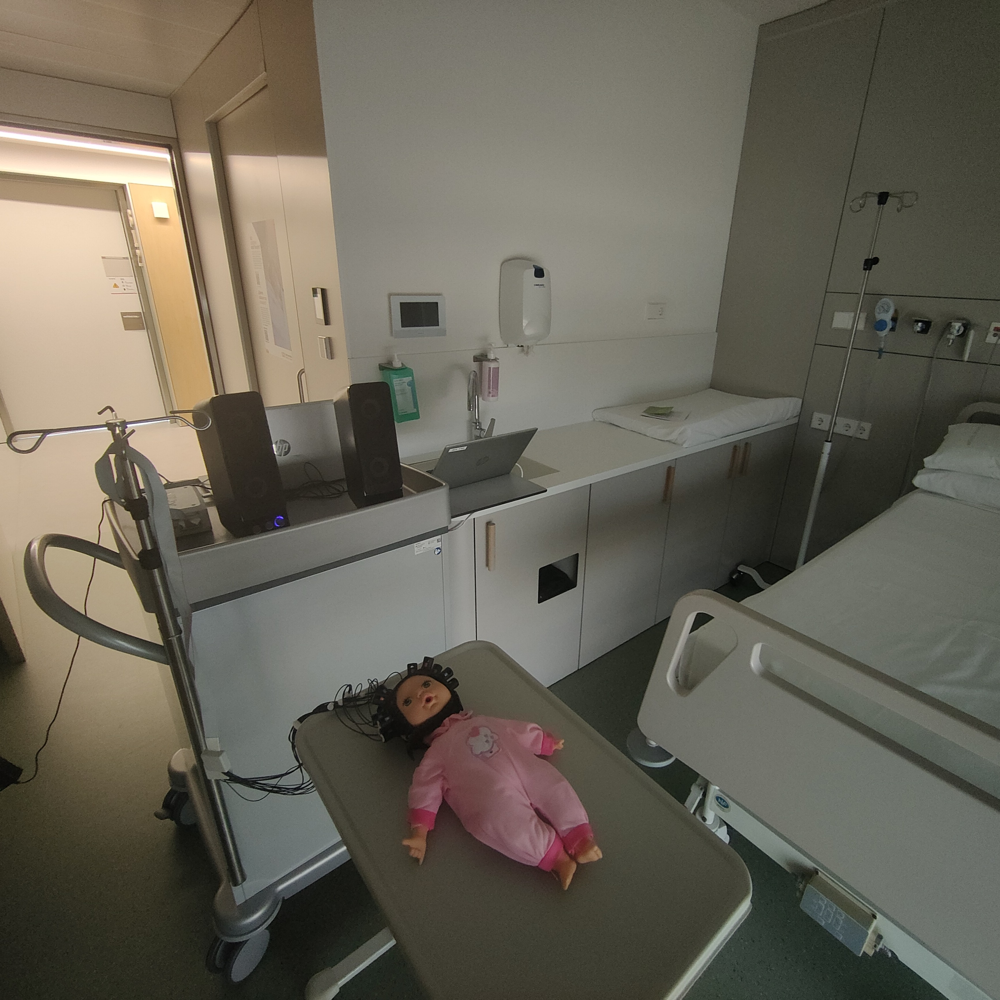


:::


## fNIRS Montage

"Chevron"-like layout^[@abboub2016prosodic]

::: {.columns}
::: {.column}
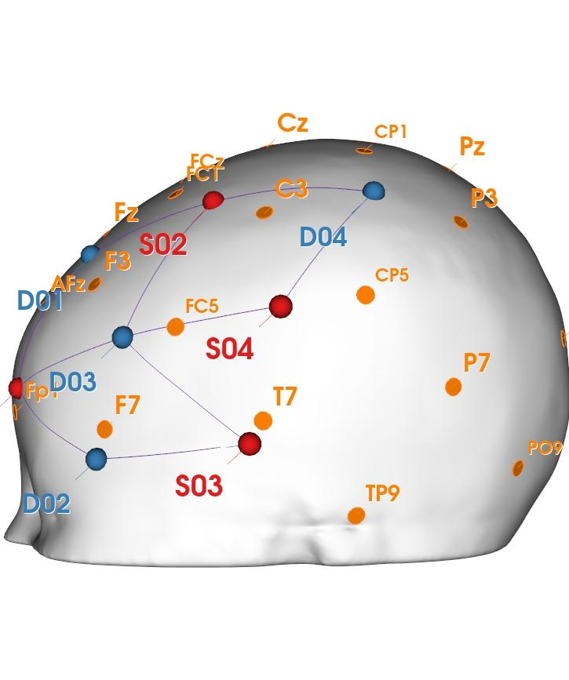
:::
::: {.column}
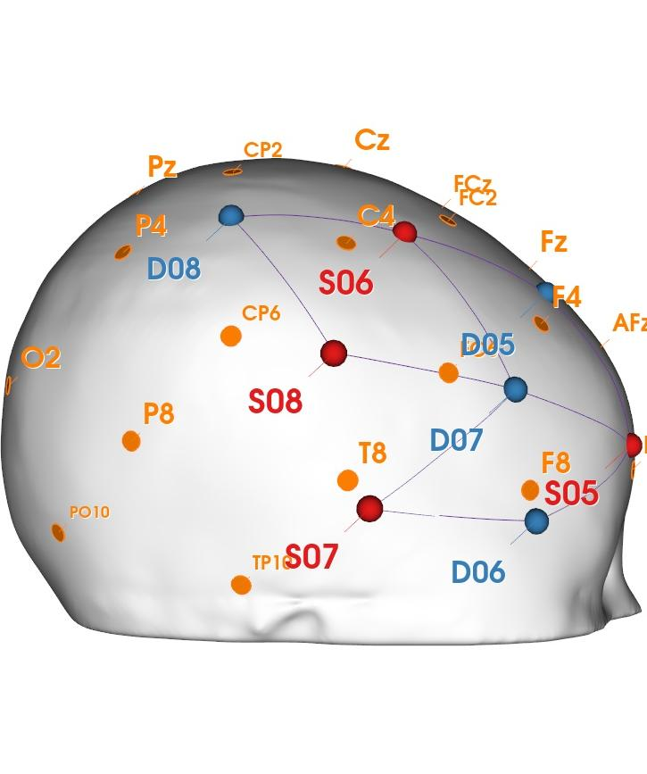
:::
:::

## fNIRS Montage

"Chevron"-like layout^[@abboub2016prosodic]

::: {.columns}
::: {.column}
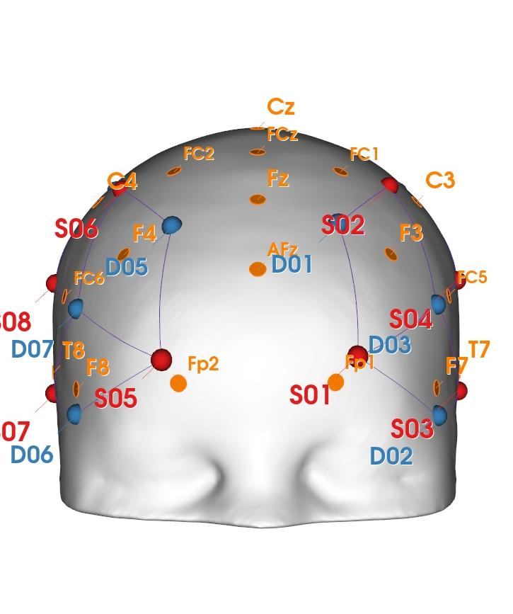
:::
::: {.column}
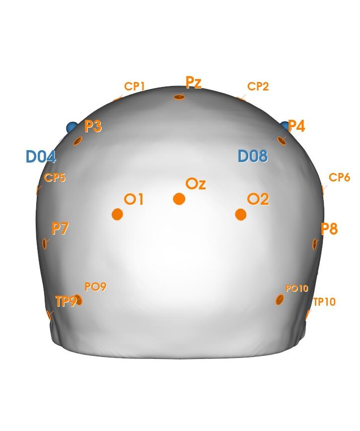
:::
:::

## fNIRS Montage

```{python}
from main import plot_sensitivity

plot_sensitivity()
```

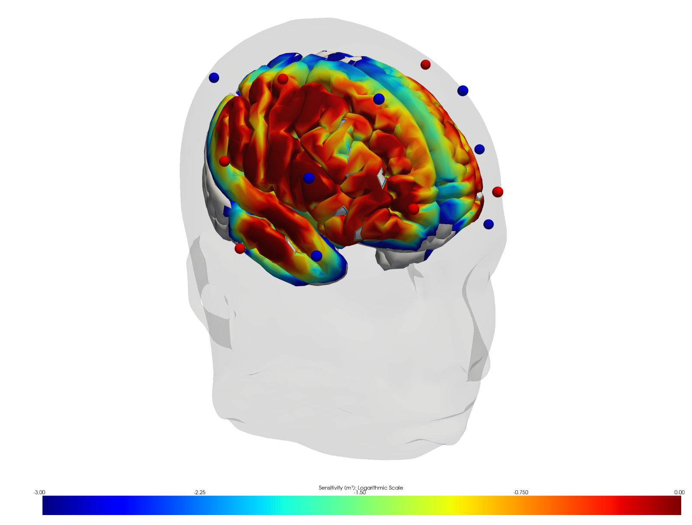

## Data processing

Cedalion toolbox^[@middell2026cedalion]:

1) Light intensity to **optical density**
2) **Channel pruning**: signal quality assessment and automatic motion identification (SCI $\geq$ 75%, amplitude $\leq$ 2.0V)
3) **Motion arctifact correction**: spline interpolation
4) Chromophore concentration: **[$\Delta\text{HbO}$]{style="background-color: #E15759; color: white"}** and **[$\Delta\text{HbR}$]{style="background-color: #4E79A7; color: white"}**
5) Physiological noise attenuation: band-pass **filter** (0.01--1.0 Hz)
6) **Signal epoching**: -5 to 57.4 seconds (baseline correction)
7) **Participant rejection** ($\geq$ 2 valid blocks per condition)
8) **Block averaging** for each participant and condition

## Data processing

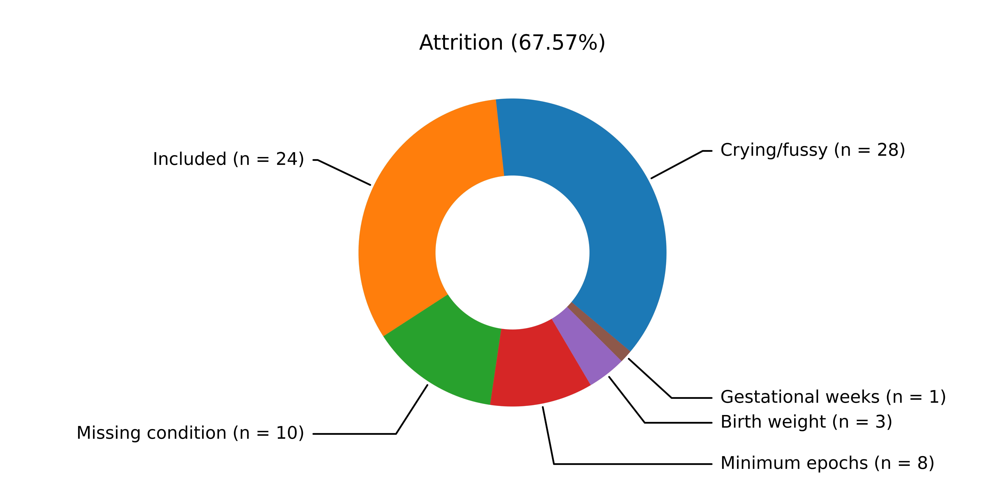

## Data processing

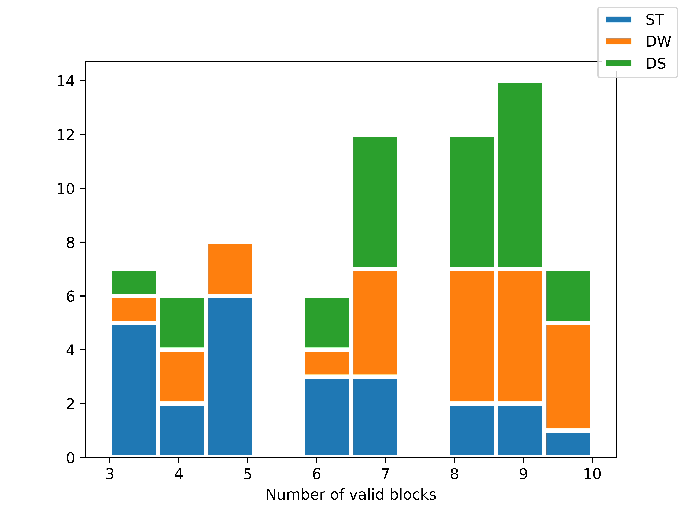

# Results

## Grand average


## Grand average by hemisphere

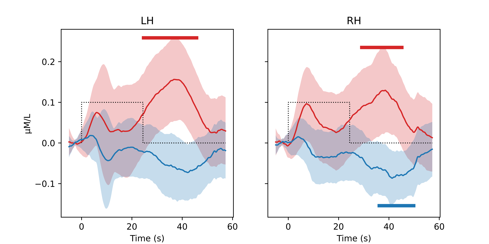

## Standard blocks [ST]{style="background-color: #5778a4; color: white"}


## Deviant word blocks [DW]{style="background-color: #e49444; color: white"}


## Deviant syllable blocks [DS]{style="background-color: #6a9f58; color: white"}


## HbO: [ST]{style="background-color: #5778a4; color: white"} vs. [DW]{style="background-color: #e49444; color: white"} vs. [DS]{style="background-color: #6a9f58; color: white"}


## HbO: [ST]{style="background-color: #5778a4; color: white"} vs. [DW]{style="background-color: #e49444; color: white"}


## HbO: [DW]{style="background-color: #e49444; color: white"} vs. [DS]{style="background-color: #6a9f58; color: white"}


## HbO: [ST]{style="background-color: #5778a4; color: white"} vs. [DS]{style="background-color: #6a9f58; color: white"}


## HbR: [ST]{style="background-color: #5778a4; color: white"} vs. [DW]{style="background-color: #e49444; color: white"} vs. [DS]{style="background-color: #6a9f58; color: white"}


## HbR: [ST]{style="background-color: #5778a4; color: white"} vs. [DW]{style="background-color: #e49444; color: white"}


## HbR: [DW]{style="background-color: #e49444; color: white"} vs. [DS]{style="background-color: #6a9f58; color: white"}


## HbR: [ST]{style="background-color: #5778a4; color: white"} vs. [DS]{style="background-color: #6a9f58; color: white"}


# Discussion

## Discussion

### Good news

* Relatively good haemodynamic response function
* Recruitment-collection-analysis pipeline up and running

## Discussion

### Bad news

* Inconclusive results
* Too much noise: motion arctifacts, participants probably too awake
* Experimental design possibly too ambitious

## Discussion

::: {.columns}
::: {.column}
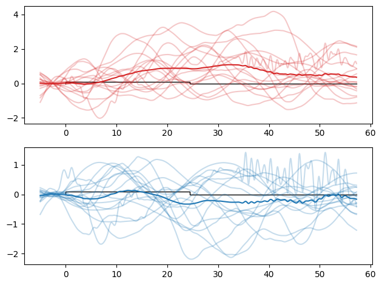
:::
::: {.column}
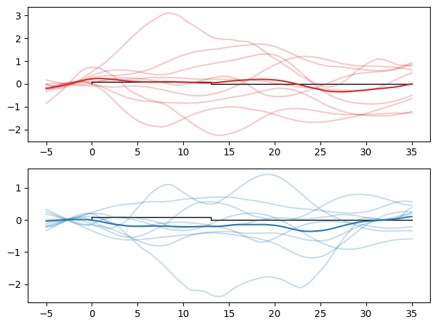
:::
:::

## Discussion

### New experimental design

* First proving discrimination between MOP+ and MOP- words, maybe then proving a preference.
* Classic block design: two conditions (MOP+ vs. MOP-)

## Discussion

### New stimuli

* Naturally recorded
* Co-articulation cues ok?
* Segmentation pause?

## Discussion

### New data collection

* Test participants only in quiet sleep
* Visual scoring of behavioural signs of quiet sleep^[@grigg2016visual]

---

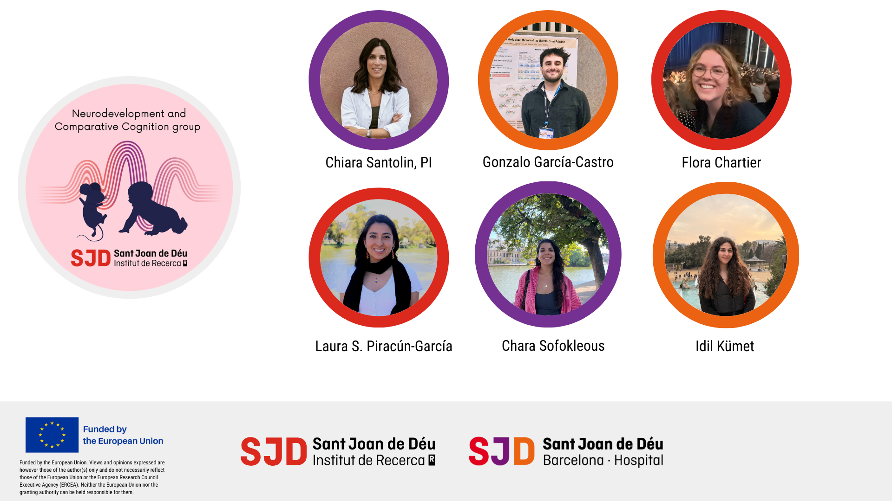{fig-align="center" valign="middle"}

# Appendix

## Task design

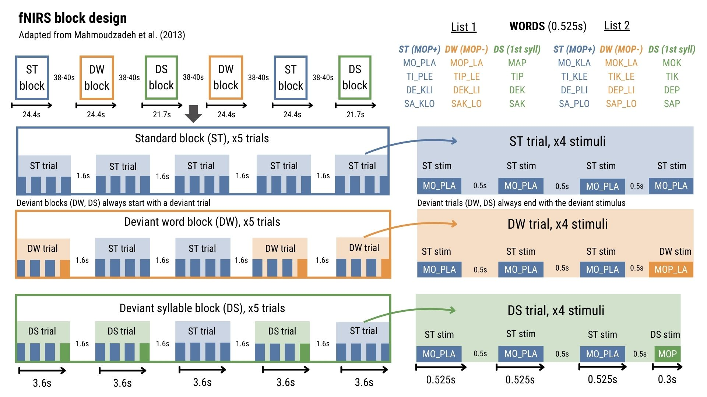


## NIRS setup

* NIRSport2 (NIRx), CW 760 nm & 850 nm
* Sampling frequency 20.345 Hz (~0.05 s samples)
* NIRScap: 8 channels LH, 8 channels RH

## References
